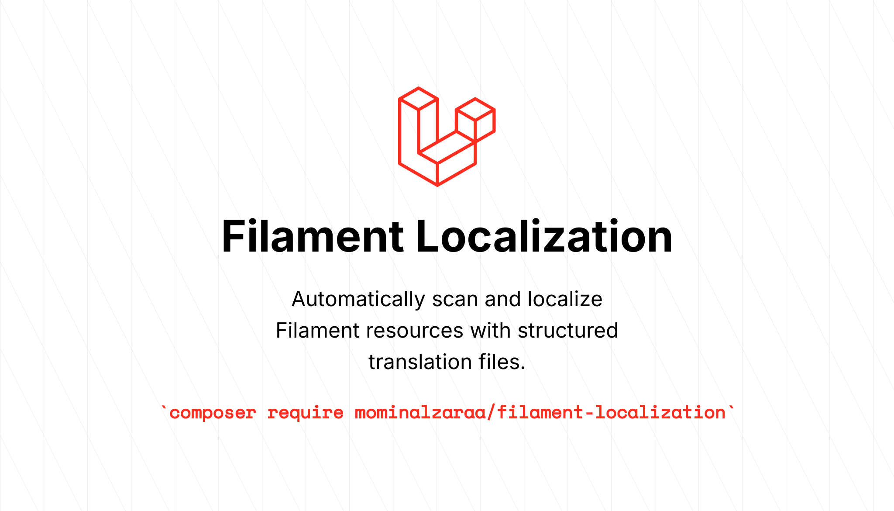
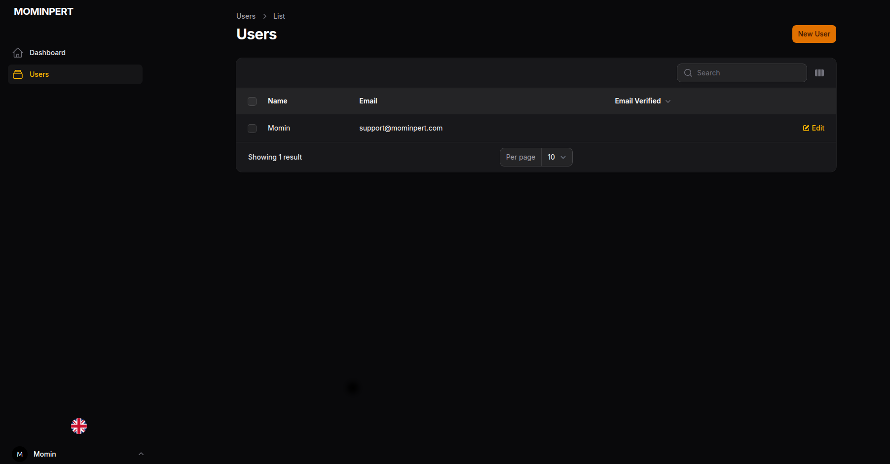
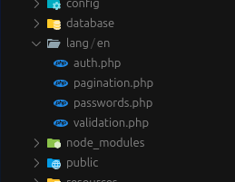
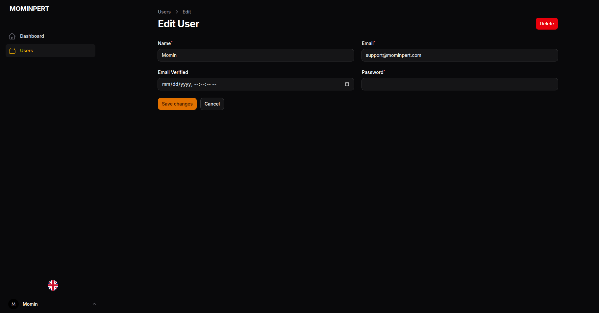
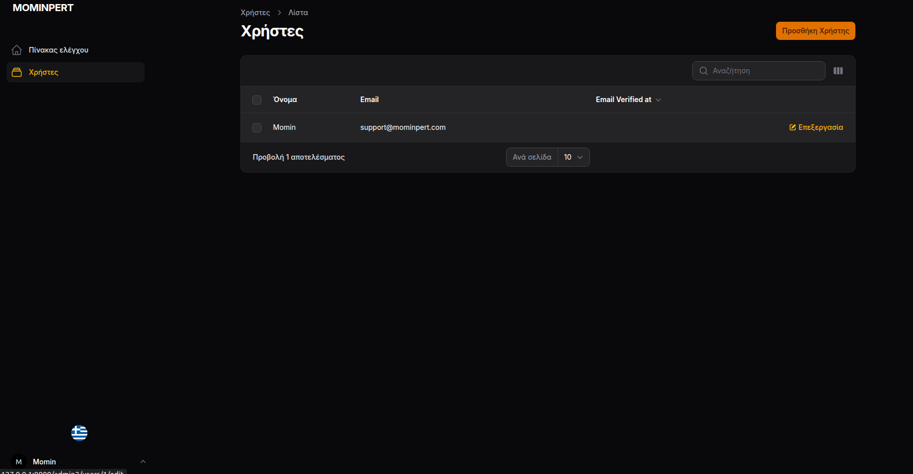
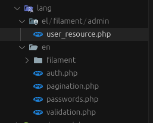
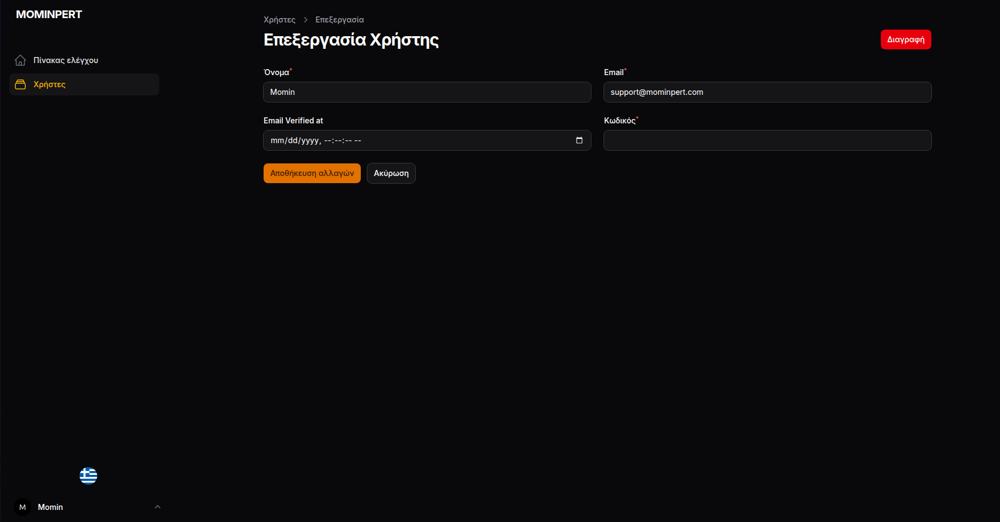

# Filament Localization Package

[](https://packagist.org/packages/mominalzaraa/filament-localization)
[](https://packagist.org/packages/mominalzaraa/filament-localization)
[](https://github.com/MominAlZaraa/filament-localization/actions/workflows/run-tests.yml)
[](https://github.com/MominAlZaraa/filament-localization/actions/workflows/code-style.yml)
[](https://github.com/MominAlZaraa/filament-localization/blob/main/LICENSE)
[](https://packagist.org/packages/mominalzaraa/filament-localization)



Automatically scan and localize Filament resources with structured translation files. This package eliminates the repetitive task of manually adding translation keys to every field, column, action, and component in your Filament application.

## Version

**License**: MIT  
**PHP Requirements**: ^8.2|^8.3|^8.4  
**Laravel Requirements**: ^12.0  
**Filament Requirements**: ^4.0

## Features

- 🚀 **Automatic Scanning**: Scans all Filament resources across all panels
- 🏗️ **Structured Organization**: Creates organized translation files following Filament's structure
- 🔄 **Git Integration**: Automatically creates a commit for easy reverting
- 📊 **Detailed Statistics**: Shows comprehensive statistics of processed files
- 🎯 **Selective Processing**: Process specific panels or all panels at once
- 🔒 **Safe Operation**: Creates backups before modifying files
- 🌍 **Multi-locale Support**: Generate translations for multiple locales simultaneously
- ⚡ **Dry Run Mode**: Preview changes without applying them
- 📦 **Zero Configuration**: Works out of the box with automatic dependency management

## Supported Components

### Form Components
- TextInput, Textarea, Select, DatePicker, DateTimePicker, TimePicker
- Checkbox, Toggle, Radio, FileUpload
- RichEditor, MarkdownEditor, ColorPicker
- KeyValue, Repeater, Builder, TagsInput
- CheckboxList, Hidden, ViewField

### Table Columns
- TextColumn, IconColumn, ImageColumn, ColorColumn
- CheckboxColumn, ToggleColumn, SelectColumn, TextInputColumn

### Infolist Entries
- TextEntry, IconEntry, ImageEntry, ColorEntry
- KeyValueEntry, RepeatableEntry

### Layout Components
- Section, Fieldset, Grid, Tabs, Wizard, Step, Group

### Other Components
- Actions, Filters, Notifications

## Installation

### Step 1: Install the Package

You can install the package via composer. This will automatically install all required dependencies:

```bash
composer require mominalzaraa/filament-localization
```

The package automatically includes:
- Laravel Framework ^12.0
- Filament ^4.0
- All other required dependencies

### Step 2: Publish Configuration

Publish the configuration file:

```bash
php artisan vendor:publish --tag="filament-localization-config"
```

## Configuration

The configuration file `config/filament-localization.php` provides extensive customization options:

```php
return [
    'default_locale' => 'en',
    'locales' => ['en', 'el'],
    'structure' => 'panel-based', // flat, nested, or panel-based
    'backup' => true,
    'git' => [
        'enabled' => true,
        'commit_message' => 'chore: add Filament localization support',
    ],
    'excluded_panels' => [],
    'excluded_resources' => [],
    'label_generation' => 'title_case', // title_case, sentence_case, or keep_original
    'preserve_existing_labels' => false,
    'translation_key_prefix' => 'filament',
];
```

## Usage

### Basic Usage

Localize all panels and resources:

```bash
php artisan filament:localize
```

### Selective Processing

Localize specific panels:

```bash
php artisan filament:localize --panel=admin
```

Generate specific locales:

```bash
php artisan filament:localize --locale=en --locale=el --locale=fr
```

### Dry Run

Preview changes without applying them:

```bash
php artisan filament:localize --dry-run
```

### Force Update

Force update even if labels already exist:

```bash
php artisan filament:localize --force
```

### Skip Git Commit

Skip automatic git commit:

```bash
php artisan filament:localize --no-git
```

## Translation File Structure

The package creates organized translation files based on your configuration:

### Panel-Based Structure (Recommended)

```
lang/
├── en/
│   └── filament/
│       ├── admin/
│       │   ├── user_resource.php
│       │   ├── post_resource.php
│       │   └── ...
│       └── blogger/
│           ├── post_resource.php
│           ├── comment_resource.php
│           └── ...
└── el/
    └── filament/
        ├── admin/
        │   ├── user_resource.php
        │   └── ...
        └── blogger/
            ├── post_resource.php
            └── ...
```

### Nested Structure

```
lang/
├── en/
│   └── filament/
│       ├── user_resource.php
│       ├── post_resource.php
│       └── ...
└── el/
    └── filament/
        ├── user_resource.php
        └── ...
```

### Flat Structure

```
lang/
├── en/
│   └── filament.php
└── el/
    └── filament.php
```

## Example Output

When you run the command, you'll see detailed progress and statistics:

```
╔════════════════════════════════════════════════════════════════╗
║                                                                ║
║          Filament Localization Package v1.0.0                  ║
║                                                                ║
║  Automatically scan and localize Filament resources            ║
║                                                                ║
╚════════════════════════════════════════════════════════════════╝

⚠️  IMPORTANT NOTICE:
This command will programmatically update your application resources.
All processing is done locally with no external usage or handling.
Your resources will be updated for localization using Laravel's locale handling.

💡 A git commit will be created after processing for easy reverting.

+---------------------------+------------------+
| Setting                   | Value            |
+---------------------------+------------------+
| Panels to process         | admin, blogger   |
| Locales to generate       | en, el           |
| Structure                 | panel-based      |
| Dry run                   | No               |
| Git commit                | Yes              |
+---------------------------+------------------+

Do you want to proceed with localization? (yes/no) [yes]:
> yes

🚀 Starting localization process...

📦 Processing panel: admin
 15/15 [============================] 100% - Processing UserResource...

📦 Processing panel: blogger
 25/25 [============================] 100% - Processing PostResource...

📊 Localization Statistics:

+---------------------------+-------+
| Metric                    | Count |
+---------------------------+-------+
| Panels Processed          | 2     |
| Resources Processed       | 40    |
| Files Modified            | 40    |
| Translation Files Created | 80    |
| Translation Keys Added    | 1,250 |
| Fields Localized          | 450   |
| Actions Localized         | 120   |
| Columns Localized         | 680   |
| Total Processing Time     | 12.5s |
+---------------------------+-------+

📝 Creating git commit...
✅ Git commit created successfully!
💡 You can revert this commit using: git reset --soft HEAD~1

✅ Localization completed successfully!
```

## How It Works

1. **Scanning**: The package scans all Filament resources in your application
2. **Analysis**: It identifies all localizable components (fields, columns, actions, etc.)
3. **Translation Files**: Creates organized translation files with default labels
4. **Resource Modification**: Updates resource files to use translation keys
5. **Git Commit**: Creates a commit for easy reverting if needed

## Language Switching Integration

To make the localization work in your Filament panels, you need to integrate a language switching plugin. This package generates the translation files, but you'll need a way for users to switch between languages in the Filament interface.

### Recommended Language Switcher Plugins

#### Option 1: craft-forge/filament-language-switcher (Recommended)

Install the language switcher plugin:

```bash
composer require craft-forge/filament-language-switcher
```

Add the plugin to your panel provider:

```php
// app/Providers/Filament/AdminPanelProvider.php
use CraftForge\FilamentLanguageSwitcher\FilamentLanguageSwitcherPlugin;

public function panel(Panel $panel): Panel
{
    return $panel
        ->plugins([
            FilamentLanguageSwitcherPlugin::make()
                ->locales([
                    ['code' => 'en', 'name' => 'English', 'flag' => 'gb'],
                    ['code' => 'el', 'name' => 'Greek', 'flag' => 'gr'],
                    ['code' => 'fr', 'name' => 'French', 'flag' => 'fr'],
                    // Add more locales as needed
                ]),
        ]);
}
```

#### Option 2: Other Language Switcher Plugins

You can also use other language switching plugins such as:
- `filament/spatie-laravel-translatable-plugin`
- `awcodes/filament-language-switcher`
- Custom language switcher implementations

### Configuration Steps

1. **Install a language switcher plugin** (see options above)
2. **Configure the plugin** in your panel provider with the same locales you used in the localization command
3. **Ensure Laravel's locale is set** properly in your application
4. **Test the language switching** to verify translations are working

### Example Panel Provider Configuration

```php
// app/Providers/Filament/AdminPanelProvider.php
<?php

namespace App\Providers\Filament;

use Filament\Http\Middleware\Authenticate;
use Filament\Http\Middleware\DisableBladeIconComponents;
use Filament\Http\Middleware\DispatchServingFilamentEvent;
use Filament\Pages;
use Filament\Panel;
use Filament\PanelProvider;
use Filament\Support\Colors\Color;
use Filament\Widgets;
use Illuminate\Cookie\Middleware\AddQueuedCookiesToResponse;
use Illuminate\Cookie\Middleware\EncryptCookies;
use Illuminate\Foundation\Http\Middleware\VerifyCsrfToken;
use Illuminate\Routing\Middleware\SubstituteBindings;
use Illuminate\Session\Middleware\AuthenticateSession;
use Illuminate\Session\Middleware\StartSession;
use Illuminate\View\Middleware\ShareErrorsFromSession;
use CraftForge\FilamentLanguageSwitcher\FilamentLanguageSwitcherPlugin;

class AdminPanelProvider extends PanelProvider
{
    public function panel(Panel $panel): Panel
    {
        return $panel
            ->default()
            ->id('admin')
            ->path('admin')
            ->login()
            ->colors([
                'primary' => Color::Amber,
            ])
            ->discoverResources(in: app_path('Filament/Resources'), for: 'App\\Filament\\Resources')
            ->discoverPages(in: app_path('Filament/Pages'), for: 'App\\Filament\\Pages')
            ->pages([
                Pages\Dashboard::class,
            ])
            ->discoverWidgets(in: app_path('Filament/Widgets'), for: 'App\\Filament\\Widgets')
            ->widgets([
                Widgets\AccountWidget::class,
                Widgets\FilamentInfoWidget::class,
            ])
            ->middleware([
                EncryptCookies::class,
                AddQueuedCookiesToResponse::class,
                StartSession::class,
                AuthenticateSession::class,
                ShareErrorsFromSession::class,
                VerifyCsrfToken::class,
                SubstituteBindings::class,
                DisableBladeIconComponents::class,
                DispatchServingFilamentEvent::class,
            ])
            ->authMiddleware([
                Authenticate::class,
            ])
            ->plugins([
                FilamentLanguageSwitcherPlugin::make()
                    ->locales([
                        ['code' => 'en', 'name' => 'English', 'flag' => 'gb'],
                        ['code' => 'el', 'name' => 'Greek', 'flag' => 'gr'],
                        ['code' => 'fr', 'name' => 'French', 'flag' => 'fr'],
                    ]),
            ]);
    }
}
```

### Important Notes

- **Locale Consistency**: Ensure the locale codes in your language switcher match the locales you generated with the localization command
- **Laravel Locale**: The language switcher will change Laravel's application locale, which will automatically load the correct translation files
- **Session Persistence**: Most language switcher plugins will persist the selected language in the user's session
- **Fallback Locale**: Make sure your `config/app.php` has a proper fallback locale configured

## Before and After

### Visual Comparison

#### Before Localization
The Filament admin interface displays in English with hardcoded labels:


*Users list page showing English labels*


*User edit form with English field labels*


*File structure showing only English translation files*

#### After Localization
The same interface now supports multiple languages with proper translation keys:


*Users list page with localized Greek labels*


*User edit form with localized Greek field labels*


*File structure showing organized translation files for multiple locales*

### Code Comparison

#### Before Localization

```php
// app/Filament/Resources/UserResource.php
TextInput::make('name')
    ->required(),

TextColumn::make('email')
    ->searchable(),

Action::make('delete')
    ->requiresConfirmation(),
```

#### After Localization

```php
// app/Filament/Resources/UserResource.php
TextInput::make('name')
    ->label(__('filament/admin/user_resource.name'))
    ->required(),

TextColumn::make('email')
    ->label(__('filament/admin/user_resource.email'))
    ->searchable(),

Action::make('delete')
    ->label(__('filament/admin/user_resource.delete'))
    ->requiresConfirmation(),
```

#### Translation File Created

```php
// lang/en/filament/admin/user_resource.php
return [
    'name' => 'Name',
    'email' => 'Email',
    'delete' => 'Delete',
    // ... more translations
];

// lang/el/filament/admin/user_resource.php
return [
    'name' => 'Όνομα',
    'email' => 'Email',
    'delete' => 'Διαγραφή',
    // ... more translations
];
```

## Safety Features

- **Backups**: Creates timestamped backups before modifying files
- **Git Integration**: Automatic commit for easy reverting
- **Dry Run**: Preview changes before applying
- **Preserve Existing**: Option to preserve existing labels
- **Error Handling**: Comprehensive error reporting

## Reverting Changes

If you need to revert the changes:

```bash
# Using git (recommended)
git reset --soft HEAD~1

# Or restore from backups
# Backup files are created with .backup.YYYY-MM-DD-HH-II-SS extension
```

## Requirements

The package automatically handles all dependencies when installed via Composer:

- **PHP**: ^8.2|^8.3|^8.4
- **Laravel Framework**: ^12.0 (automatically installed)
- **Filament**: ^4.0 (automatically installed)
- **Spatie Laravel Package Tools**: ^1.16 (automatically installed)

No additional setup required - just install and use!

## Testing

```bash
composer test
```

## Changelog

Please see [CHANGELOG](CHANGELOG.md) for more information on what has changed recently.

## Contributing

Contributions are welcome! Please feel free to submit a Pull Request.

## Security Vulnerabilities

If you discover a security vulnerability, please send an e-mail to [support@mominpert.com](mailto:support@mominpert.com). All security vulnerabilities will be promptly addressed.

## Credits

- [Momin Al Zaraa](https://github.com/MominAlZaraa) - Creator and Maintainer

## License

The MIT License (MIT). Please see [License File](LICENSE.md) for more information.

## Support

If you find this package helpful, please consider:
- ⭐ Starring the repository
- 🐛 Reporting issues
- 💡 Suggesting new features
- 🤝 Contributing code

For support and questions:
- 📧 Email: [support@mominpert.com](mailto:support@mominpert.com)
- 🌐 Website: [mominpert.com](https://mominpert.com)
- 💬 GitHub Issues: [Report an issue](https://github.com/MominAlZaraa/filament-localization/issues)
- 📖 GitHub Discussions: [Ask a question](https://github.com/MominAlZaraa/filament-localization/discussions)

## Roadmap

- [ ] Support for custom components
- [ ] Translation suggestions using AI
- [ ] Batch translation import/export
- [ ] Translation validation
- [ ] IDE integration
- [ ] Web UI for managing translations

## FAQ

**Q: Will this overwrite my existing translations?**  
A: No, by default it preserves existing translations. You can change this in the config.

**Q: Can I use this with custom Filament components?**  
A: Currently it supports standard Filament components. Custom component support is planned.

**Q: Does this work with Filament plugins?**  
A: Yes, it works with any Filament resources in your application.

**Q: Can I customize the translation key format?**  
A: Yes, you can customize the prefix and structure in the configuration file.

**Q: Is this safe to use in production?**  
A: Yes, but we recommend testing in a development environment first and using the dry-run mode.

**Q: Do I need to install Filament separately?**  
A: No, the package automatically installs Filament and all required dependencies when you run `composer require mominalzaraa/filament-localization`.

**Q: How do I enable language switching in my Filament panels?**  
A: This package only generates the translation files. You need to install a language switcher plugin like `craft-forge/filament-language-switcher` and configure it in your panel provider to allow users to switch between languages.

**Q: Can I use any language switcher plugin?**  
A: Yes, you can use any Filament language switcher plugin that changes Laravel's application locale. Popular options include `craft-forge/filament-language-switcher`, `filament/spatie-laravel-translatable-plugin`, or `awcodes/filament-language-switcher`.
